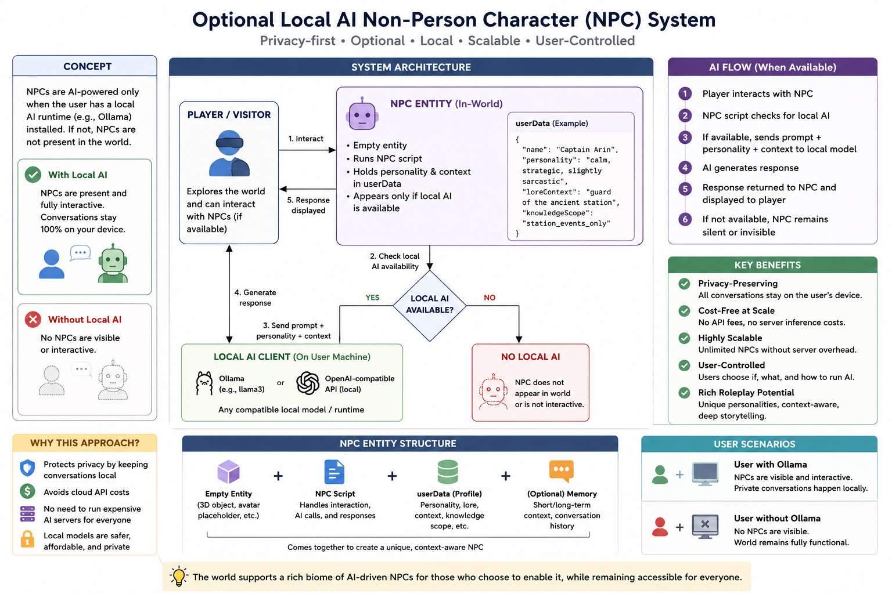

# Optional Local AI Non-Player Character (NPC) System

## Overview

The **Optional Local AI Non-Player Character (NPC)** approach is a design pattern for integrating AI-driven characters into virtual worlds while prioritizing **privacy, cost efficiency, and user control**.

Instead of relying on centralized cloud-based AI services, NPCs are designed to operate **only when a local AI runtime is available on the user’s machine** (such as Ollama or compatible OpenAI-type local endpoints). If no local AI is installed, the NPCs simply do not activate.

This creates a **graceful, opt-in AI layer** in the environment rather than a mandatory dependency.




---
## Installation in Overte
Edit > Running Scripts...  
Load scripts > Click "From URL" button.  
Enter: https://aleziakurdis.github.io/localAiNPC/app-npcGenerator.js  

This will add the NPC generator app, and it will allow you to fill NPC profile and install them in-world.

## Core Idea

Each NPC is an **empty interactive entity** in the world that contains:

- A script capable of communicating with a local AI backend
- A **personality profile stored in `userData`**
- Optional contextual memory tied to the world or storyline

The NPC does not itself “think” or generate responses. Instead, it acts as a **bridge between the environment and the user’s local AI model**.

If no local AI service is detected, the NPC remains inactive or invisible.

---

## Key Motivations

### 1. Privacy First Design

One of the main concerns with AI-driven NPCs is that conversations can include:

- Personal thoughts
- Roleplay content
- Private user behavior

Sending this data to cloud servers introduces privacy risks.

With a local-first approach:

- Conversations stay on the user’s machine
- No external data transmission is required
- Users retain full control of their interaction data

This makes the system suitable for immersive roleplay environments where privacy matters.

---

### 2. Cost and Scalability Constraints

Cloud-based AI systems introduce recurring costs:

- API usage fees per interaction
- Infrastructure scaling costs for hosting NPC logic
- Maintenance overhead for real-time interaction systems

If every NPC in a world required cloud inference, the cost would scale quickly and become impractical.

By contrast:

- Local AI shifts compute cost to the user
- No centralized infrastructure is required
- Worlds can support unlimited NPCs without server cost increases

---

### 3. Optional Participation Model

Not all users have or want AI installed locally.

This approach is intentionally **non-mandatory**:

- Users with no local AI → NPCs simply do not appear or respond
- Users with local AI → full NPC interaction becomes available

This avoids:
- Broken experiences for non-AI users
- Forced dependency on external services
- Performance issues on low-end systems

---

### 4. Compatibility Across AI Backends

The system is designed to be **backend-agnostic**, supporting multiple local or API-compatible AI providers:

- Ollama (local models)
- OpenAI-compatible local endpoints
- Future custom runtimes

This is achieved by using a **common request interface**, allowing the same NPC script to switch seamlessly between providers.

---

## System Architecture

### NPC Entity Structure

Each NPC exists as a lightweight world entity:

- No embedded intelligence
- Script-driven behavior only
- Personality stored in metadata

Example `userData` concept:

```json
{
    "name": "Captain Arin",
    "id": "0764be1e-893f-42a8-93f8-13993987ccc4",
    "profile": "Captain Arin is a cybernetically enhanced female space pirate. She grew up in a brutal environment. She is highly intelligent, skilled in combat, and emotionally guarded, often expressing herself through sarcasm or aggression rather than vulnerability. Her story arc centers on trauma, identity, forgiveness, and rebuilding trust.",
    "greeting": "Hey, are you a terran?",
    "context": "We are currently on the Ceon, a space pirate cove owned by the alliance. This is a pirate and reseller operation base. It has been build over an abandonned mining infrastructure.",
    "temperature": 0.7,
    "radius": 5.0,
    "npcModelUrl": "",
    "npcAnimationUrl": ""
}
```
This makes each NPC:
- Unique
- Consistent in behavior
- Context-aware within the world narrative

---

### AI Flow

1. Player interacts with NPC
2. Script checks for local AI availability
3. If available:
   - Sends prompt + personality + context to local model
4. AI generates response
5. Response is returned to NPC and displayed
6. If not available:
   - NPC remains silent or non-interactive

---

## Benefits of This Approach

### ✔ Privacy-Preserving

No conversation data leaves the user’s device.

### ✔ Cost-Free at Scale

No server-side inference costs or API usage fees.

### ✔ Highly Scalable Worlds

NPC count is not limited by backend infrastructure.

### ✔ User-Controlled AI Experience

Users decide:
- Whether AI exists in their world
- Which model powers it
- How much performance they allocate

### ✔ Rich Roleplay Potential

Because each NPC is tied to:
- Personality profiles
- World state
- Local context

It becomes possible to build **dense AI-driven storytelling environments**.

---

## Limitations

While powerful, this approach has trade-offs:

- NPC availability depends on user setup
- AI quality varies by installed model
- No shared global AI consistency across users
- Requires local installation (e.g., Ollama setup)

These limitations are intentional, prioritizing autonomy over uniform experience.

---

## Use Cases

This system is particularly suited for:

- Virtual worlds and social VR platforms
- Roleplay environments
- Sandbox storytelling systems
- AI-enhanced games with user-side compute
- Experimental NPC ecosystems

---

## Conclusion

The **Optional Local AI Non-Player Character system** provides a balanced alternative to centralized AI NPC architectures. It embraces a simple principle:

> AI-driven characters should be optional, local, and user-controlled.

By combining lightweight in-world entities with optional local inference (such as Ollama or OpenAI-compatible APIs), this approach enables rich, immersive NPC ecosystems while respecting privacy, reducing costs, and maximizing accessibility.